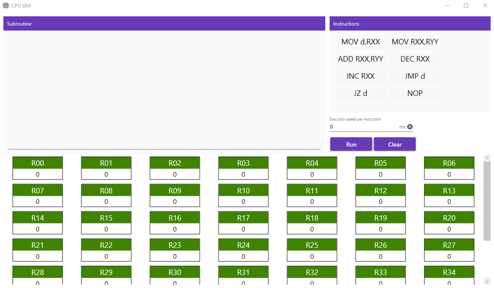
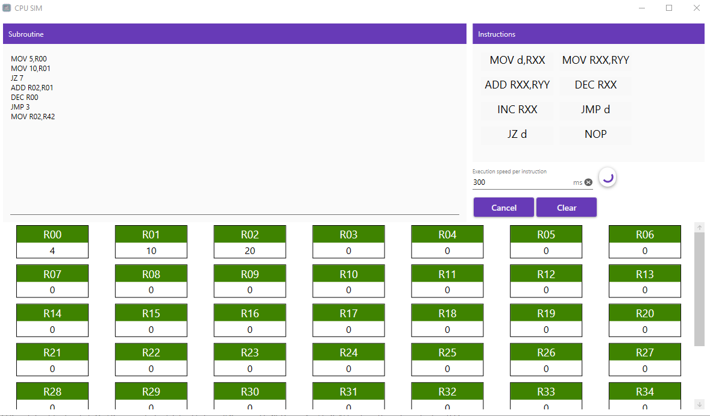

# CPUSimulator

The CPU has 43 32-bit unsigned integer registers, which are named R00..R42. At the start of the program, all the registers contain 0. 

-The CPU supports the following instructions:
  - MOV Rxx,Ryy - copies the value from register Rxx to register Ryy;
  - MOV d,Rxx - copies the numeric constant d (specified as a decimal) to register Rxx;
  - ADD Rxx,Ryy - calculates (Rxx + Ryy) MOD 232 and stores the result in Rxx;
  - DEC Rxx - decrements Rxx by one. Decrementing 0 causes an overflow and results in 232-1;
  - INC Rxx - increments Rxx by one. Incrementing 232-1 causes an overflow and results in 0;
  - INV Rxx - performs a bitwise inversion of register Rxx;
  - JMP d - unconditionally jumps to instruction number d (1-based). d is guaranteed to be a valid instruction number;
  - JZ d - jumps to instruction d (1-based) only if R00 contains 0;
  - NOP - does nothing.

- Features :
  - Clear button : erase all registers, Clear the program zone)
  - Run button: compile and run instructions one by one without blocking the UI
  - Execution Speed: time to add between instruction 
  - Cancel button: appear after starting execution.
- Technologies:
 NET 5, Xaml, WPF, Sprache, NUnit
 

